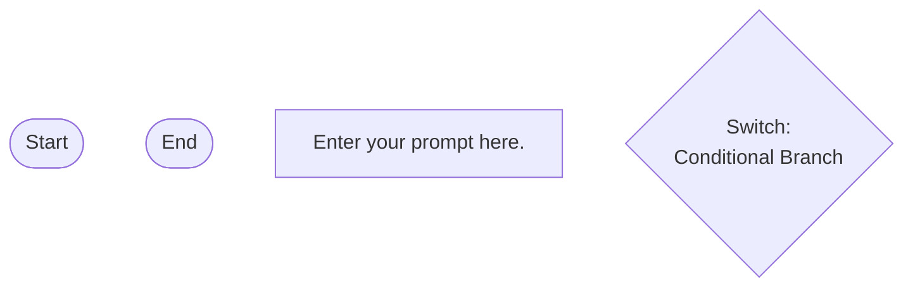

## Workflow Execution Guide

Follow the Mermaid flowchart above to execute the workflow. Each node type has specific execution methods as described below.

### Execution Methods by Node Type

- **Rectangle nodes (Sub-Agent: ...)**: Execute Sub-Agents
- **Diamond nodes (AskUserQuestion:...)**: Use the AskUserQuestion tool to prompt the user and branch based on their response
- **Diamond nodes (Branch/Switch:...)**: Automatically branch based on the results of previous processing (see details section)
- **Rectangle nodes (Prompt nodes)**: Execute the prompts described in the details section below

### Prompt Node Details

#### prompt_1773457973885(Enter your prompt here.)

```
Enter your prompt here.

You can use variables like {{variableName}}.
```

### Switch Node Details

#### switch_1773457975665(Multiple Branch (2-N))

**Branch conditions:**
- **Case 1**: When condition 1 is met
- **Case 2**: When condition 2 is met
- **default**: Other cases

**Execution method**: Evaluate the results of the previous processing and automatically select the appropriate branch based on the conditions above.
